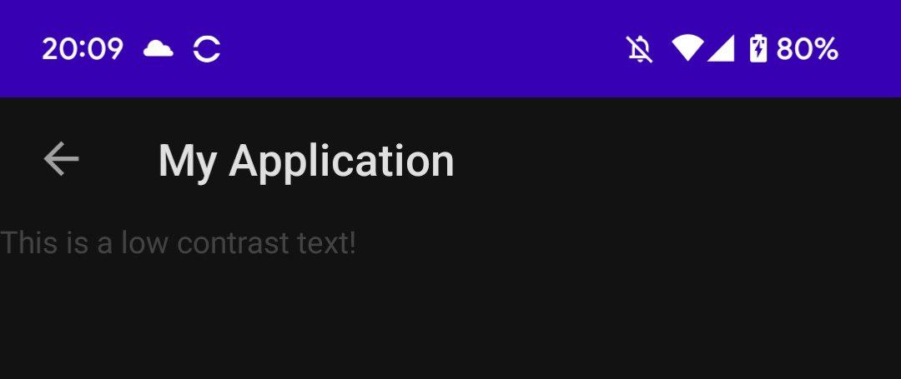

AccessibilityLoon
========

Accessibility testing library for Android.

[](https://jitpack.io/#Zudoku/accessibility-loon)

How it works
--------

AccessibilityLoon is a library built ontop of Googles [Accessibility-Test-Framework-for-Android](https://github.com/google/Accessibility-Test-Framework-for-Android).

The library works by monitoring the current Activity and periodically analyzing the current view tree.

If an accessibility issue is found, the issue will be reported to LogCat:




```
W  --- [AccessibilityLoon] Found accessibility problem ---
W  View: [resourceName=com.example.myapplication:id/title, id=7, class=com.google.android.material.textview.MaterialTextView]
W  Severity: WARNING
W  Problem: Text contrast
W  Description: The item's text contrast ratio is 1.92. This ratio is based on an estimated foreground color of <tt>#444444</tt> and an estimated background color of <tt>#121212</tt>. Consider increasing this item's text contrast ratio to 4.50 or greater.
W  -------------------------------------------------------
```

The library is intended to make it easy to spot accessibility issues while doing development, instead of relying on Pre-launch report on Play Store or Firebase test lab. 

**Note:** This library is intended to be run with the debug version of your app. If you are thinking about accessibility testing on UI tests, consider using [Accessibility-Test-Framework-for-Android](https://github.com/google/Accessibility-Test-Framework-for-Android) directly instead of this library.

This library takes a lot of inspiration from LeakCanary.


Configuration
--------

AccessibilityLoon will start up automatically but if you need to customize the configuration, you can do it the following way:

```kotlin
AccessibilityLoon.config = AccessibilityLoon.config
    .copy(
        useScreenshotsForAccessibilityChecks = false,
        performCheckIntervalMs = TimeUnit.SECONDS.toMillis(15)
    )
```

By default, the library will screenshot the view tree to figure out contrast issues. This can be turned off, but it will make the the detection of some accessibility issues impossible.

Download
--------

This library is available in [Jitpack](https://jitpack.io/#Zudoku/accessibility-loon).


```kotlin
dependencies {
    debugImplementation 'com.github.Zudoku:accessibility-loon:0.1.0'
}
```

Make sure that you have included Jitpack as a repository:

```kotlin
repositories {
    maven { url 'https://jitpack.io' }
}
```

